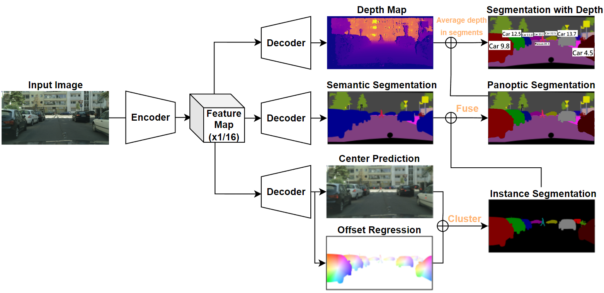
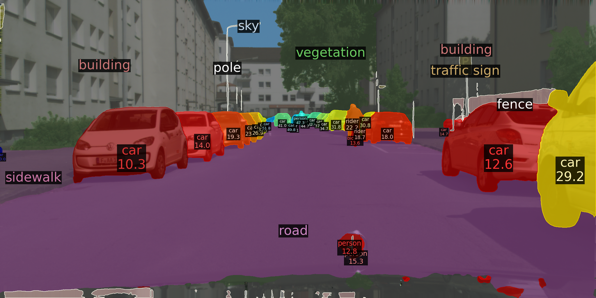
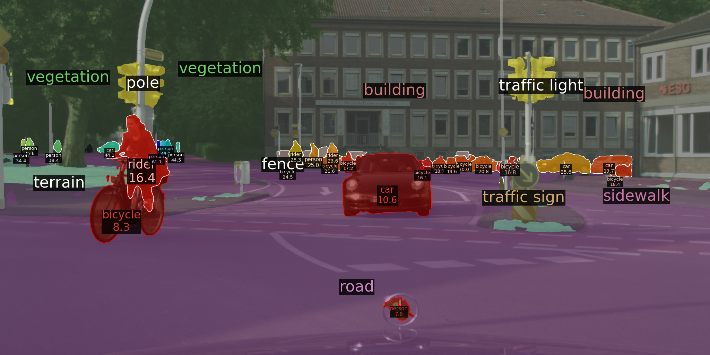
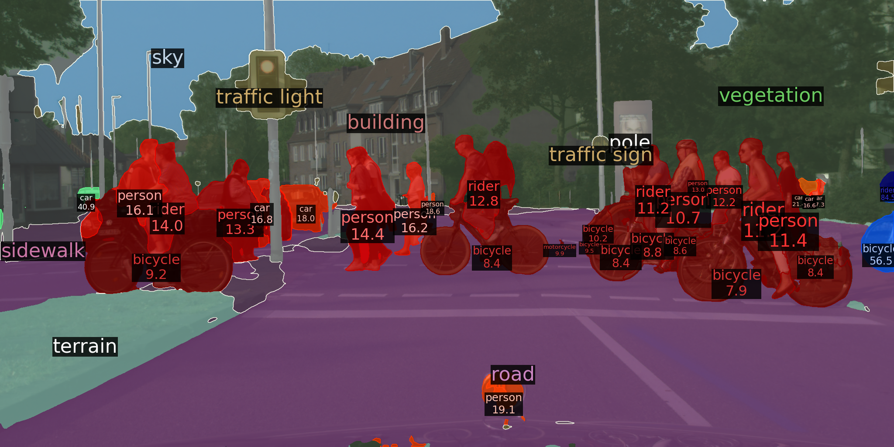

# Panoptic-Depth Color Map for Combination of Depth and Image Segmentation

Jia-Quan Yu, Soo-Chang Pei

[[`arXiv`](https://arxiv.org/abs/1911.10194)]

<div align="center">
  
</div><br/>

## Installation
Install Detectron2 following [the instructions](https://detectron2.readthedocs.io/tutorials/install.html).
To use cityscapes, prepare data follow the [tutorial](https://detectron2.readthedocs.io/tutorials/builtin_datasets.html#expected-dataset-structure-for-cityscapes).

## Training

To train a model with 2 GPUs run:
```bash
python train_net.py \
--config-file configs/Cityscapes-PanopticSegmentation/panoptic_depthlab.yaml \
--num-gpus 2 \
MODEL.WEIGHTS model_final_bd324a.pkl
--resume
```
## Inference
```bash
export CUDA_VISIBLE_DEVICES=0
python train_net.py \
--config-file configs/Cityscapes-PanopticSegmentation/panoptic_depthlab.yaml \
--eval-only MODEL.WEIGHTS output_depthlab_L1loss/<the_ckpt_you_want_to_use>.pth
```

## Demo Result

<div align="center">
  
</div><br/>

<div align="center">
  
</div><br/>

<div align="center">
  
</div><br/>